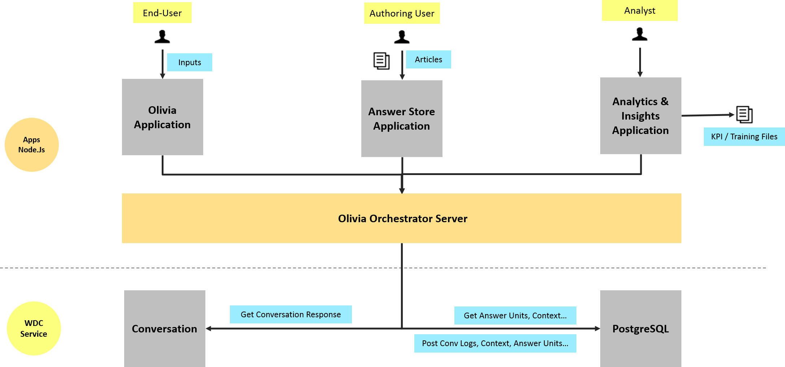
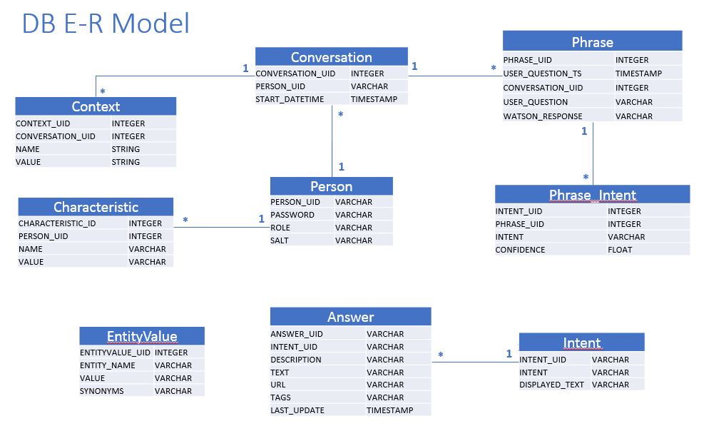
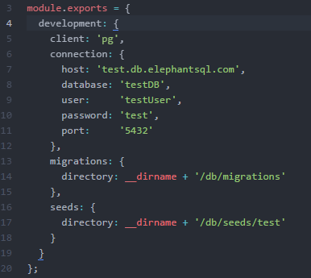
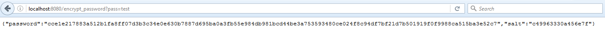
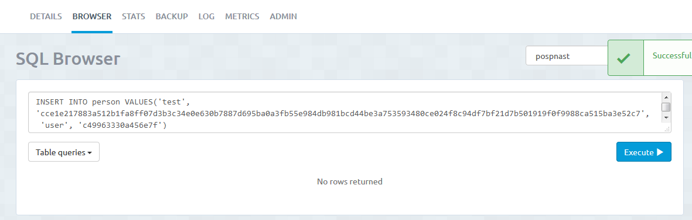
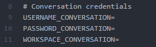

# Summary

- [Olivia Orchestrator v1.1.0](#a-olivia-orchestrator-v110)
	- [Description](#a1-description)
	- [Optional Linked Applications](#a2-optional-linked-applications)
- [Architecture Overview](#b-architecture-overview)
	- [Asset Architecture](#b1-asset-architecture)
	- [Database Architecture](#b2-database-architecture)
- [App Deployment and Continuous Integration](#c-app-deployment-and-continuous-integration)
    - [Using Cloudfoundry CLI tool to Deploy your Application](#c1-using-cloudfoundry-cli-tool-to-deploy-your-application)
    - [Deploying the App Locally](#c2-deploying-the-app-locally)
	- [Database set up](#c3-database-set-up)
    - [Watson Conversation Service environment variables](#c4-watson-conversation-service-environment-variables)
- [API Examples](#d-api-examples)
- [Change Log](#e-change-log)
- [Road Map](#f-road-map)


# A. Olivia Orchestrator v1.1.0

## A.1. Description
**Olivia Orchestrator** is an asset to use Watson Conversation service with more integrated features as:
* Save conversation logs in DB (Compatibility with PostgreSQL and MySQL)
* Retrieve the history of a customer conversation
* Use customer data in DB to customize the conversation
* User authentication using information in the Person table

### Conversation - Natural language conversation
The conversation service enables the creation of a cognitive agent (bot). Once its setup it can answer users questions based on identified **Intents** (using machine learning) and **Entities** (key words).
This service is best used to handle a limited / known scope (Fat Head questions / FAQ). It should be configured for each new project.
For instance, first applications built on top of this framework :
* An IT Support Assistant for a A&D Company, able to manage several ALM Applications
* A second application for HR processes


## A.2. Optional Linked Applications
The **Olivia Application** is an optional UI meant for testing purposes and could eventually be replaced by a client application.
For more informations please visit : https://github.ibm.com/CognitiveAssetFactory/Olivia-Conversation

The **Answer Store** is a user friendly UI meant to help the authoring-user to manage and upload answer units.
For more informations please visit : https://github.ibm.com/CognitiveAssetFactory/CogAss-AnswerStore


# B. Architecture Overview

## B.1. Asset Architecture



The application consists of 2 core layers:
* Custom Developed Application
* Watson Developper Cloud Services

Conversation, see the [detailed documentation] : http://www.ibm.com/watson/developercloud/conversation.html .

## B.2. Database Architecture



**Note:** All the variables in the Characteristic table will be sent to the Watson Conversation services as context variables (that can be used to customize the conversation).

The current version of the asset uses Knex to support many different SQL DB with a little amount of coding. It currently supports PostgreSQL DB (version >= 9.5) and MySQL DB. If you need to use another DB, please open an issue on this repository.

To deploy the asset using ElephantSQL service on Bluemix, go to "**C.3. Database set up**".


# C. App Deployment and Continuous Integration

## C.1. Using Cloudfoundry CLI tool to deploy your application and create the services: 

**To build the application:**

1_ Download and install the [Cloudfoundry CLI](https://github.com/cloudfoundry/cli) tool.

2_ Git clone the project `https://github.ibm.com/CognitiveAssetFactory/Olivia-Orchestrator`

3_ Navigate to the `Olivia-Orchestrator` folder

4_ Connect to Bluemix in the command-line tool:

 For US Region

 ```sh
 $ cf api https://api.ng.bluemix.net
 ```

 ```sh
 $ cf login -u <your user ID>
 ```

5_ Create the Conversation service in Bluemix:

 ```sh
 $ cf create-service conversation free conversation-service
 ```

6_ Create the ElephantSQL service in Bluemix:

 ```sh
 $ cf create-service elephantsql tiny-turtle elephantsql-service
 ```
 
7_ Push it live:

 ```sh
 $ cf push <application-name>
 ```
 The name you use determinates your application URL initially, such as `<application-name>.mybluemix.net`.

 
## C.2. Deploying the App Locally: 

**This step is mandatory if you want to use Knex to set up your DB**

The application uses [Node.js](http://nodejs.org/) and [npm](https://www.npmjs.com/).

1_ Install [Node.js](http://nodejs.org/).

2_ Open the terminal, go to the project folder, and run this command:
```sh
npm install
```

3_  Start the application by running this command:
```sh
npm start
```

4_ As the Orchestrator is a REST API, you can test the endpoints using a tool like Postman and the URL `http://localhost:8080`.

Note: If you are interested in deploying your local application or the changes you have made locally to Bluemix, go to "**C.1. Using Cloudfoundry CLI tool to deploy your application**".


## C.3. Database set up 

** In this part, we will use the ElephantSQL as an example. **

**Warning: If you are on a UK Bluemix, you won't be able to use ElephantSQL as the version is 9.3. 
We recommend you to use ClearDB if you are looking for a free service to test the asset.** 

The project is using Knex to easily build and access the DB. 

### C.3.1. Install Knex

To install Knex run:
```
npm install knex -g
```
** Warning: You may need to use 'sudo' to have root rights **

### C.3.2. Update the configuration file
If you created an ElephantSQL service, follow these steps to retrieve the required configuration information:

1_ Go to the Bluemix Dashboard and select the ElephantSQL service instance. Once there, click on OPEN ELEPHANTSQL DASHBOARD.

2_ In the DETAILS tab, the URL field indicates all the credentials you need with the format:
postgres://DATABASE:DB_PWD@DB_HOSTNAME:DB_PORT/DB_UID

3_ Copy the credentials (or remember this location).

4_ Open knexfile.js.

5_ Replace '<client>' with 'pg' as you are using a PostgreSQL DB.

5_ Replace the other credentials with the ones you've copied earlier.



** Deploy your application, go to "C.1. Using Cloudfoundry CLI tool to deploy your application"**.

### C.3.3. Initialize the DB

To create the tables, run:
```
knex migrate:latest --env development
```

Note: This command uses the file(s) in the folder ./db/migrations/ to create the tables. 

If you want to handle multiple environment, duplicate the configuration object 'development', give it another name ('test' for example) and use the command `knex migrate:latest --env test`

### C.3.4. Add user authentication information
To use the login page, you need users with password (encrypted with sha512 and using 'salt') in the database.

As we don't have an endpoint to create a user for now, you can get your encrypted password and salt with the following endpoint `<your-application-url>/encrypt_password?pass=<your_password>`.


Also, each user has a role ('author' or 'user') to identify the different applications users (Chat Bot or Answer Store).

Then, you can insert it in your DB. For PostgreSQL, you can use the following SQL command:
```
INSERT INTO person VALUES('<user_name>', '<encrypted_password>', '<role>', '<salt>')
```



## C.4. Watson Conversation Service environment variables 

### C.4.1 Get the service credentials

1_ Go to the Bluemix Dashboard and select the Conversation service instance. Once there, select the **Service Credentials** menu item.

2_ Select **ADD CREDENTIALS**. Name your credentials then select **ADD**.

3_ Copy the credentials (or remember this location).

4_ Open the .env file and locate the Conversation credentials.



5_ Replace the service credentials (username and password) with the ones you've created earlier.

Note : You can also provide the service credentials for the app by using environment variables. You can check the "Adding environment variables in Bluemix" section.


### C.4.2 Import a workspace

To use the app you're creating, you need to add a worksapce to your Conversation service. A workspace is a container for all the artifacts that define the behavior of your service (ie: intents, entities and chat flows). For this sample app, a workspace is provided.

For more information on workspaces, see the full  [Conversation service  documentation](https://www.ibm.com/smarterplanet/us/en/ibmwatson/developercloud/doc/conversation/overview.shtml).

1_ Navigate to the Bluemix dashboard, select the Conversation service that you created.

2_ Go to the **Manage** menu item and select **Launch Tool**. This opens a new tab in your browser, where you are prompted to login if you have not done so before. Use your Bluemix credentials.

3_ If you are deploying through Bluemix, download the [exported JSON file](https://raw.githubusercontent.com/watson-developer-cloud/conversation-simple/master/training/car_workspace.json) that contains the Workspace contents. If deploying locally,  this was cloned and is in the training folder (training/car_workspace.json).

4_ Select the import icon: . Browse to (or drag and drop) the JSON file. Choose to import **Everything(Intents, Entities, and Dialog)**. Then select **Import** to finish importing the workspace.

5_ Refresh your browser. A new workspace tile is created within the tooling. Select the _menu_ button within the workspace tile, then select **View details**:

&nbsp;&nbsp;&nbsp;&nbsp;&nbsp;&nbsp;&nbsp;&nbsp;&nbsp;&nbsp;&nbsp;&nbsp;

In the Details UI, copy the 36 character UNID **ID** field. This is the **Workspace ID**.


&nbsp;&nbsp;&nbsp;&nbsp;&nbsp;&nbsp;&nbsp;&nbsp;&nbsp;&nbsp;&nbsp;&nbsp; 

### C.4.3 Adding environment variables in Bluemix

1_ In Bluemix, open the application from the Dashboard. Select **Runtime**.

2_ Select **Environment Variables**.

3_ Select **ADD**.

4_ Add a variable with the name **WORKSPACE_ID**. For the value, paste in the Workspace ID you [copied earlier](#workspaceID). Select **SAVE**.

5_ Restart your application.


# D. API examples

### Authentication
``` javascript
// SERVER SIDE
var domain = YOUR_ORCHESTRATOR_URL;
var authEndpoint = "/authentication";
var auth_token;

var auth = function() {
	// Get the credentials user / password
	var payload = {
		app_ID: process.env.API_USER,
		password: process.env.API_PASS
	};
	var options = {
		url: domain + authEndpoint,
		form: payload,
	};

	// Call to the API
	rq.post(options, function (err, response, body) {
		if (err) {
			console.log("Error auth: " + err);
		} else {
			body = JSON.parse(body);
			if(body.success) {
				auth_token = body.token; // Save the token
			}	else {
				console.log("Error auth: wrong user/password");
			}
		}
	});
}
```

### Conversation
``` javascript
// SERVER SIDE
var domain = YOUR_ORCHESTRATOR_URL;
var convEndpoint = "/api/conversation";

app.post('/api/message', function(req, res) {

  var payload = {};

  // Retrieve the information from client
  // If new conversation -> conversation_ID and user_input can be empty
  // Set admin_tag to true if you want the full_response from conversation
  if (req.body) {
    payload.user_input = req.body.user_input;
	payload.client_ID = req.body.client_ID;
	payload.admin_tag = req.body.admin_tag || false;
	if(req.body.conversation_ID)
		payload.conversation_ID = req.body.conversation_ID;
  }

	var options = {
		url: domain + convEndpoint,
		form: payload,
		headers: {
    	'x-access-token': auth_token
		}
	}

  rq.post(options, function (err, response, body) {
		if (err) {
			return res.status(err.code || 500).json(err);
		} else {
			return res.json(JSON.parse(body));
		}
  });

});
```

## Other available endpoints
### Conversation history
``` http
-- QUERY --
GET https://YOUR_ORCHESTRATOR_URL/api/conversation/conversation_ID HTTP/1.1

Accept: application/json
x-access-token: YOUR_TOKEN
Cache-Control: no-cache

-- RESPONSE --
{
  "conversation_ID": "13",
  "conversation_log": [
    {
      "client": "",
      "watson": "{\"Hello. How can I help you?\"}"
    },
    {
      "client": "How can I have a reimbursement for my car expenses?",
      "watson": "{\"You can find all the information on "car expenses" on this page.\"}"
    }
  ]
}
```

### Customer history
``` http
-- QUERY --
GET https://YOUR_ORCHESTRATOR_URL/api/client/client_ID/history  HTTP/1.1

Accept: application/json
x-access-token: YOUR_TOKEN
Cache-Control: no-cache


-- RESPONSE --
{
	"conversation_history" : [
			"1","2","3"
	]
}
```

# E. Change Log

## E.1 V 1.1.0

- Use of Knex to create and manage the DB
- Compatibility with PostgreSQL and MySQL
- User authentication using information in the Person table
- Answer Store features:
	* New tables (Answer, Intent, EntityValue) for the Answer Store
	* Endpoint to update these tables using the Conversation workspace
	* Endpoints to get / update these tables

# F. Road Map

- Integration with DB2 
- HTTPS or HTTP + JSON Web Token
- Parallel processes with BlueBird
- Parallel servers
	* Stateless
	* Load balancer
- Complex processing of Watson's answer
	* Use of flags
	* Internal exchange with Watson

"# Olivia-Orchestrator-Test" 
